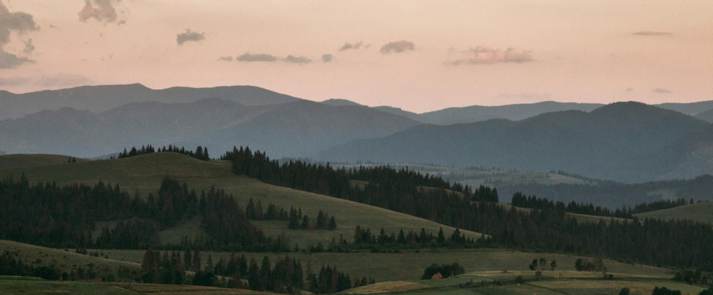
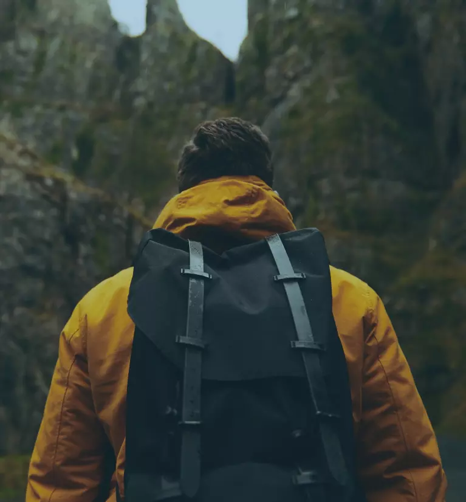
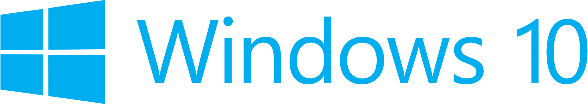
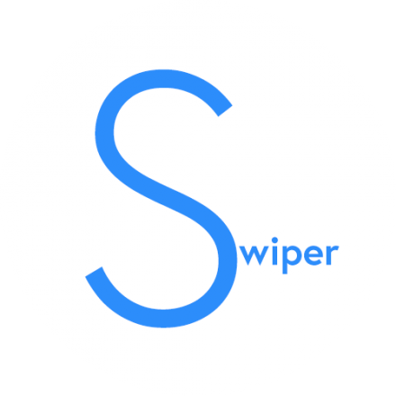

<h1 align="center" style="color: #2222ec; font-family: Roboto Mono,Consolas,Liberation Mono,Courier New,Courier,monospace;
    font-size: 55px;
    font-weight: 700;">
CARP TRAVEL <p style="color: yellow">app</p> 
</h1>

<div align="center" color="#694e04" style="color: #694e04; font-family: Roboto Mono,Consolas,Liberation Mono,Courier New,Courier,monospace;
    font-size: 22px;
    font-weight: 500;">
Carpathians travel secrets landing page.
</div>
<div align='center'>

<!--  -->
</div>

---

<div align="center">

</div>

<div align="center" style="margin-left: auto; margin-right: auto; width: fit-content;">
<a></a>
<a></a>
<a></a>
<a></a>
<a></a>
<a></a>
<a></a>
<a></a>
<a></a>
<a></a>
</div>

---

<div align="center">
<h3>BASE Live URL: <a href="https://carp-travel-app-ten.vercel.app/" target="_blank" rel="noreferrer noopener">Carp Travel</a></h3>
</div>

---

## Content

-   [TS & Mockup](#TS)
-   [Technologies](#Technologies)
-   [Development](#Development)
-   [Project Developer](#Developer)

---

## TS

-   [TS](https://docs.google.com/document/d/1e6U2nDowFARzF6JNMKMDcVRVd7syu36m/edit#heading=h.d6whnyfnqdlb)
-   [Design Mockup](https://www.figma.com/file/2nHaXyrwQxqXLYmPUGQuP1/CarpTravel---%D0%A2%D0%B5%D1%81%D1%82%D0%BE%D0%B2%D0%B5-%D0%B7%D0%B0%D0%B2%D0%B4%D0%B0%D0%BD%D0%BD%D1%8F?type=design&node-id=348-14&mode=design&t=CUtzaKhf6WQBfOgb-0)

## Technologies

-   [JavaScript]
-   [TypeScript]
-   [NextJS]
-   [HTML5]
-   [CSS3]
-   [TailwindCSS]
-   [Swiper]
-   [React-Hook-Form]
-   [React-Scroll]
-   [React-Responsive]

---

## Development

### Clone this repository to your local machine:

To clone repo, run the following command:

`git clone` [tap!](https://github.com/Ljuzifer/carp-travel-app.git)

### Installing Dependencies

To install dependencies, run the following command:

```sh
$ npm i
```

### Running the Development Server

To run the dev server, run the following command:

```sh
$ npm run dev
```

---

## Developer

<div align="center">
  
</div>

<div align="center">
  <h4>Created by &copy; Ljuzifer</h4>
  <a href="https://www.linkedin.com/in/ljuzifer/" target="_blank" rel="noopener norefferer">
    
  </a>
</div>
<div align='center'>
<a href="https://t.me/Ljuzifer" target="_blank" rel="noreferrer"> 
<picture> 
 
</picture> 
</a>
<a href="mailto:ljuzifer@gmail.com" target="_blank" rel="noreferrer"> 
<picture> 
 
</picture> 
</a>
</div>
